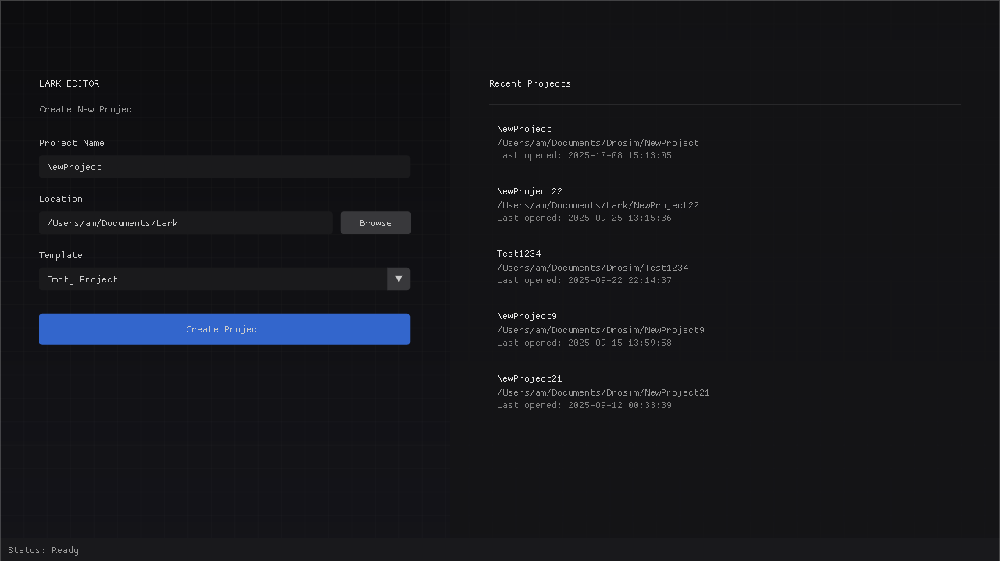
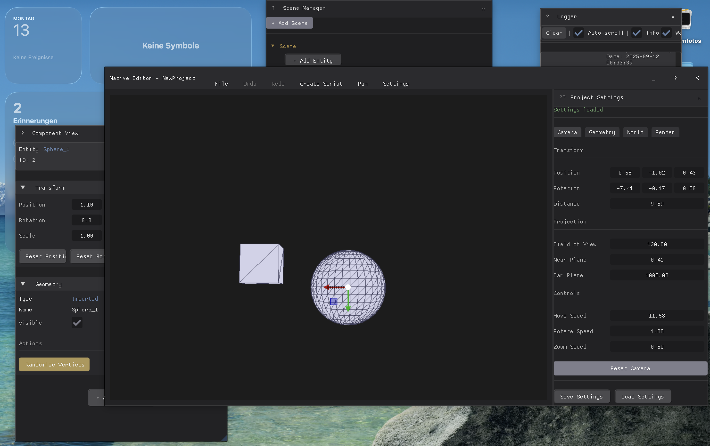

# Lark

## Overview

Lark is a simulation framework MVP that utilizes Data-Oriented Programming to efficiently manage and simulate complex
entities and behaviors. Lark is a learning project and still on going.





## Important!!

Old Implementation guide below not up to date.

## Implementation

### Data-Oriented Programming

Lark uses mostly Data-Oriented Programming to optimize data layout and access patterns.

## How to Implement New Components

### Creating a New Component

1. **Header File:**
   Create a header file for your component in the `Lark/Components/` directory. Define the component's data structure
   and necessary functions. For example:
   ```cpp
   #pragma once
   #include "Entity.h"

   namespace drosim::tag {
       struct init_info {
           // Add any initialization data needed
       };

       class component {
       public:
           explicit component(tag_id id) : _id(id) {}

           bool is_valid() const { return id::is_valid(_id); }
           tag_id get_id() const { return _id; }

       private:
           tag_id _id;
       };

       component create(init_info info, game_entity::entity entity);
       void remove(component c);
   }
   ```

2. **Source File:**
   Implement the component's functionality in a corresponding `.cpp` file. For example:
   ```cpp
   #include "TagComponent.h"
   #include "Entity.h"

   namespace drosim::tag {
       namespace {
           util::vector<id::id_type> id_mapping;
           util::vector<id::generation_type> generations;
           util::vector<tag_id> free_ids;

           bool exists(tag_id id) {
               assert(id::is_valid(id));
               const id::id_type index = id::index(id);
               return generations[index] == id::generation(id);
           }
       }

       component create(init_info info, game_entity::entity entity) {
           assert(entity.is_valid());
           tag_id id{};

           if (free_ids.size() > id::min_deleted_elements) {
               id = free_ids.front();
               free_ids.pop_back();
               id = tag_id{ id::new_generation(id) };
               ++generations[id::index(id)];
           } else {
               id = tag_id{ static_cast<id::id_type>(id_mapping.size()) };
               id_mapping.emplace_back();
               generations.push_back(0);
           }

           id_mapping[id::index(id)] = entity.get_id();
           return component{id};
       }

       void remove(component c) {
           assert(c.is_valid() && exists(c.get_id()));
           const tag_id id = c.get_id();
           id_mapping[id::index(id)] = id::invalid_id;
           free_ids.push_back(id);
       }
   }
   ```

3. **Integration:**
   Integrate the new component in the relevant parts of the system where other components like `Script` and `Transform`
   are integrated.

## API

See EngineDLL

### Testing

See Tests

### Documentation

### Credits

This repository was implemented using guides like the Primal GameEngine
Series (https://www.youtube.com/c/GameEngineSeries) as well as the
Rotorpy Repository (https://github.com/spencerfolk/rotorpy)
